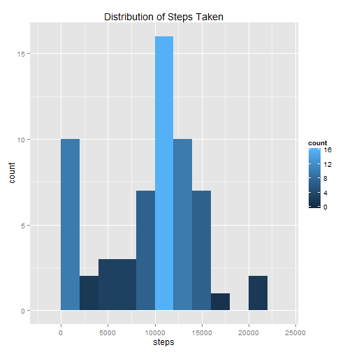

Peer Assessment 1
=================


**Loading and preprocessing the data**

1. Load the data (i.e. read.csv())
2. Process/transform the data (if necessary) into a format suitable for your analysis


```r
library("data.table")
setwd("C:/Users/pavkoj1/Desktop/Coursera/05 Reproducible Research/PeerAssessment_01")
dt <- data.table(read.csv("activity.csv"))
dt$date <- as.Date(dt$date)
str(dt)
```

```
## Classes 'data.table' and 'data.frame':	17568 obs. of  3 variables:
##  $ steps   : int  NA NA NA NA NA NA NA NA NA NA ...
##  $ date    : Date, format: "2012-10-01" "2012-10-01" ...
##  $ interval: int  0 5 10 15 20 25 30 35 40 45 ...
##  - attr(*, ".internal.selfref")=<externalptr>
```

```r
dt
```

```
##        steps       date interval
##     1:    NA 2012-10-01        0
##     2:    NA 2012-10-01        5
##     3:    NA 2012-10-01       10
##     4:    NA 2012-10-01       15
##     5:    NA 2012-10-01       20
##    ---                          
## 17564:    NA 2012-11-30     2335
## 17565:    NA 2012-11-30     2340
## 17566:    NA 2012-11-30     2345
## 17567:    NA 2012-11-30     2350
## 17568:    NA 2012-11-30     2355
```


**What is mean total number of steps taken per day?**

For this part of the assignment, you can ignore the missing values in the dataset.

1. Calculate the total number of steps taken per day
2. If you do not understand the difference between a histogram and a barplot, research the difference between them. Make a histogram of the total number of steps taken each day
3. Calculate and report the mean and median of the total number of steps taken per day


```r
library("ggplot2")
dt.steps <- dt[,.(steps=sum(steps, na.rm=TRUE)),by=c("date")]

p <- ggplot() +
  geom_histogram(data=dt.steps, aes(x=steps, fill = ..count..), binwidth = 2000) +
  ggtitle("Distribution of Steps Taken")
p
```

 

```r
mean(dt.steps$steps, na.rm=TRUE)
```

```
## [1] 9354.23
```

```r
median(dt.steps$steps, na.rm=TRUE)
```

```
## [1] 10395
```


**What is the average daily activity pattern?**

1. Make a time series plot (i.e. type = "l") of the 5-minute interval (x-axis) and the average number of steps taken, averaged across all days (y-axis).
2. Which 5-minute interval, on average across all the days in the dataset, contains the maximum number of steps?


```r
dt.ts <- dt[,.(steps=mean(steps, na.rm=TRUE)), by=c("interval")]
p <- ggplot() +
  geom_line(data=dt.ts, aes(x=interval, y=steps), stat="identity") +
  ggtitle("Number of Steps Taken by Interval")
p
```

 

```r
max_steps <- dt.ts[,max(steps)]
max_interval <- dt.ts[steps==max_steps,interval]
```
The maximum average steps taken is 206.2, and it is on the 835 minute interval.


**Imputing missing values**

1. Calculate and report the total number of missing values in the dataset (i.e. the total number of rows with NAs)
2. Devise a strategy for filling in all of the missing values in the dataset. The strategy does not need to be sophisticated. For example, you could use the mean/median for that day, or the mean for that 5-minute interval, etc.
3. Create a new dataset that is equal to the original dataset but with the missing data filled in.
4. Make a histogram of the total number of steps taken each day and Calculate and report the mean and median total number of steps taken per day. Do these values differ from the estimates from the first part of the assignment? What is the impact of imputing missing data on the estimates of the total daily number of steps?


```r
missing_vals <- nrow(dt) - nrow(na.omit(dt))

# use na
library("zoo")
x <- na.approx(dt$steps, 1:nrow(dt), na.rm=FALSE)
x[is.na(x)] <- 0
dt[,steps2:=x]
```

```
##        steps       date interval steps2
##     1:    NA 2012-10-01        0      0
##     2:    NA 2012-10-01        5      0
##     3:    NA 2012-10-01       10      0
##     4:    NA 2012-10-01       15      0
##     5:    NA 2012-10-01       20      0
##    ---                                 
## 17564:    NA 2012-11-30     2335      0
## 17565:    NA 2012-11-30     2340      0
## 17566:    NA 2012-11-30     2345      0
## 17567:    NA 2012-11-30     2350      0
## 17568:    NA 2012-11-30     2355      0
```

```r
dt.ts2 <- dt[,.(steps2=mean(steps2)), by=c("interval")]

p <- ggplot() +
  geom_line(data=dt.ts2, aes(x=interval, y=steps2), stat="identity") +
  ggtitle("Number of Steps Taken by Interval")
p
```

 

```r
max_steps <- dt.ts[,max(steps)]
max_interval <- dt.ts[steps==max_steps,interval]

max_steps2 <- dt.ts2[,max(steps2)]
max_interval2 <- dt.ts2[steps2==max_steps2,interval]
```

I filled in the missing data using the zoo package, specifically na.approx. It changed the max step average from 206.2 to 179.1. The interval of the max average steps stayed consistant at 835.

**Are there differences in activity patterns between weekdays and weekends?**

1. Create a new factor variable in the dataset with two levels - "weekday" and "weekend" indicating whether a given date is a weekday or weekend day.
2. Make a panel plot containing a time series plot (i.e. type = "l") of the 5-minute interval (x-axis) and the average number of steps taken, averaged across all weekday days or weekend days (y-axis). See the README file in the GitHub repository to see an example of what this plot should look like using simulated data.


```r
library("lubridate")
dt[,wday:=wday(date)]
```

```
##        steps       date interval steps2 wday
##     1:    NA 2012-10-01        0      0    2
##     2:    NA 2012-10-01        5      0    2
##     3:    NA 2012-10-01       10      0    2
##     4:    NA 2012-10-01       15      0    2
##     5:    NA 2012-10-01       20      0    2
##    ---                                      
## 17564:    NA 2012-11-30     2335      0    6
## 17565:    NA 2012-11-30     2340      0    6
## 17566:    NA 2012-11-30     2345      0    6
## 17567:    NA 2012-11-30     2350      0    6
## 17568:    NA 2012-11-30     2355      0    6
```

```r
dt[wday %in% c(1,7),day_type:=as.factor("weekend")]
```

```
##        steps       date interval steps2 wday day_type
##     1:    NA 2012-10-01        0      0    2       NA
##     2:    NA 2012-10-01        5      0    2       NA
##     3:    NA 2012-10-01       10      0    2       NA
##     4:    NA 2012-10-01       15      0    2       NA
##     5:    NA 2012-10-01       20      0    2       NA
##    ---                                               
## 17564:    NA 2012-11-30     2335      0    6       NA
## 17565:    NA 2012-11-30     2340      0    6       NA
## 17566:    NA 2012-11-30     2345      0    6       NA
## 17567:    NA 2012-11-30     2350      0    6       NA
## 17568:    NA 2012-11-30     2355      0    6       NA
```

```r
dt[wday %in% c(2,3,4,5,6),day_type:=as.factor("weekday")]
```

```
##        steps       date interval steps2 wday day_type
##     1:    NA 2012-10-01        0      0    2  weekday
##     2:    NA 2012-10-01        5      0    2  weekday
##     3:    NA 2012-10-01       10      0    2  weekday
##     4:    NA 2012-10-01       15      0    2  weekday
##     5:    NA 2012-10-01       20      0    2  weekday
##    ---                                               
## 17564:    NA 2012-11-30     2335      0    6  weekday
## 17565:    NA 2012-11-30     2340      0    6  weekday
## 17566:    NA 2012-11-30     2345      0    6  weekday
## 17567:    NA 2012-11-30     2350      0    6  weekday
## 17568:    NA 2012-11-30     2355      0    6  weekday
```

```r
dt.wday <- dt[,.(steps=mean(steps, na.rm=TRUE)), by=c("day_type","interval")]
p <- ggplot() +
  geom_line(data=dt.wday, aes(x=interval, y=steps), stat="identity") +
  facet_grid(day_type ~ .) +
  ggtitle("Number of Steps Taken by Interval")
p
```

 


